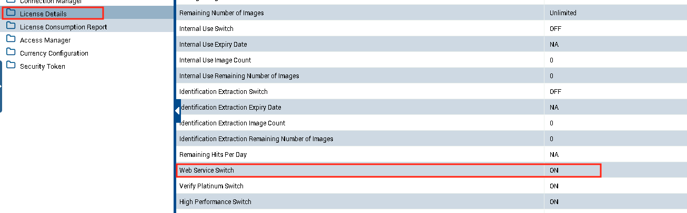

# Ephesoft Transact Powershell

This repository contains PowerShell cmdlets for developers and administrators to develop, deploy, and manage the Ephesoft Transact application.

## Installation

### [PowerShell Gallery](https://www.powershellgallery.com/)

Run the following command in an elevated PowerShell session to install the module for Ephesoft Transact CMDlets:

```powershell
Install-Module -Name Ephesoft.Transact
```

This module runs on Windows PowerShell 7.0 or greater.

If you have an earlier version of the Ephesoft Transact PowerShell module installed from the PowerShell Gallery and would like to update to the latest version, run the following command in an elevated PowerShell session:

```powershell
Update-Module -Name Ephesoft.Transact
```

`Update-Module` installs the new version side-by-side with previous versions. It does not uninstall the previous versions.

## Usage

### Discovering cmdlets

Use the `Get-Command` cmdlet to discover cmdlets within a specific module, or cmdlets that follow a specific search pattern:

```powershell
# List all cmdlets in the Ephesoft.Transact module
Get-Command -Module Ephesoft.Transact

# List all cmdlets that contain TransactBatch
Get-Command -Name '*TransactBatch*'
```

### Cmdlet help and examples

To view the help content for a cmdlet, use the `Get-Help` cmdlet:

```powershell
# View the basic help content for Get-TransactBatchClassList
Get-Help -Name Get-TransactBatchClassList

# View the examples for Import-TransactBatchClass
Get-Help -Name Import-TransactBatchClass -Examples

# View the full help content for Submit-TransactBatch
Get-Help -Name Submit-TransactBatch -Full
```

## Examples of Consuming Transact Web Services using PowerShell

The examples presented in the powershell script file are meant to provide examples of consuming the following Transact Web Service Calls. These can be used as a starting point to help build out calls to other Transact Web Service calls that are available.

### Example Transact Web Services provided: ###

* Learn Fuzzy DB
* Restart a Batch Instance


### Pre-requisite ###

1) <strong>The Transact Server that the web service call is sent to should have "Web Services" enabled on the Ephesoft Transact License.</strong>



2) Powershell v7 - These examples are designed to work on PowerShell 7, you will need to run them in v7 of Powershell:

https://docs.microsoft.com/en-us/powershell/scripting/install/installing-powershell-on-windows?view=powershell-7.2


### Configuring the Powershell Script Examples ###

1) First step is to fill out the following variables for the Transact server environment:

* <strong>$TransactHostname</strong> -  Specify the hostname of Transact Server. The value of "localhost" is used by default if running on Transact server directly
* <strong>$TransactServerPort</strong> - Specify the port being used by Transact Server. If using Out of Box (OOB) for http, then it would normally be "8080", however if using SSL, it is most likely "443"
* <strong>$httpOrHTTPS</strong> - Specify either "http" or "https" depending on Transact configuration. If using Out of Box configuration, most likely leave default as "http"
	


2) Second steps is to fill out User Credential/Authenitcation information:

For OOB Tomcat authentication or LDAP, configure the following:

* <strong>$user</strong> - username of Transact User
* <strong>$pass</strong> - password of Transact User

	
For SSO, then comment out lines 20 - 26, these are used for basic Tomcat/ldap authentication. The script will utilize the credentials of the logged in user/executing the Powershell script when attempting to make the Transact Web Service call


#### Example - Configuring Learn Fuzzy DB Web Service ###

To use/consume the "Learn Fuzzy DB" Web Service call in Transact, the following variables can be configured in the Powershell script example:

* <strong>$batchClassID</strong> - This should be the Batch Class you want to perform the "Learn Fuzzy DB" action on
* <strong>$docType</strong> - This should be the "Document Type Name" that is in the Batch Class containing the Fuzzy Database configuration that you want to "Learn DB"
	


#### Example - Configuring Restart a Batch Instance Web Service ###

To use/consume the "Restart Batch Instance" Web Service call in Transact, the following variables can be configured in the Powershell script example:

* <strong>$batchIDtoRestart</strong> - This should be the Batch Instance ID of the Batch you wish to restart
* <strong>$moduleToRestart</strong> - This should be the "Module Name" at which point in the Batch Class workflow that you wish to Restart the Batch Instance. For example, in the default value provided "Extraction_Module", the Batch will be restarted at "Extraction" in the Batch Workflow.
	


	
### Link for all available Transact Web Service calls ###

The complete list of api/Web Service calls that are available to use in Transact can be found here:

https://ephesoft.com/docs/products/transact/developers/web-services-api/web-services-explorer/


## Contributing
Please see the [CONTRIBUTING.md](CONTRIBUTING.md) file

## License
Please see the [LICENSE.md](LICENSE.md) file

## ChangeLog
Please see the [CHANGELOG.md](CHANGELOG.md) file